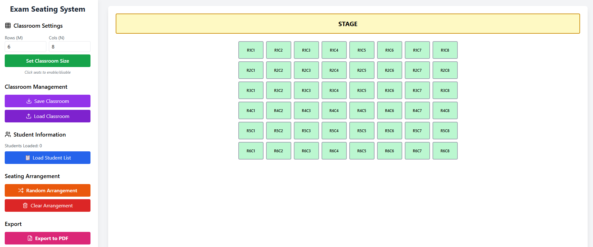

# Exam Seating System - Web Version


A modern, browser-based exam seating arrangement system built with React. Generate randomized seating charts with support for custom classroom layouts, CSV student imports, and PDF exports—all running entirely in your browser with no backend required.

🌐 **[Seating System Web](https://jameslin102.github.io/Seating-System-Web/)**

## ✨ Features

### 🏫 Flexible Classroom Configuration
- Define custom classroom dimensions (M × N grid)
- Visual stage/platform indicator at the front
- Click to enable/disable specific seats to match actual classroom layouts
- Save and load classroom configurations (JSON format)

### 👥 Student Management
- Import student lists from CSV files
- Interactive column selector for flexible CSV formats
- Supports UTF-8 encoding
- Real-time student count display

### 🎲 Smart Seating Arrangement
- One-click random seat assignment
- Visual color-coded seat status:
  - 🟢 **Green**: Available seats
  - 🩷 **Pink**: Disabled seats
  - 🔵 **Blue**: Assigned seats
- Easy clearing and rearrangement

### 📄 PDF Export
- High-quality PDF generation with full Chinese character support
- Professional seating chart layout
- Landscape A4 format optimized for printing
- Preserves all visual styling and colors

### 💾 Browser Storage
- All processing happens locally in your browser
- No data is sent to any server
- Privacy-focused design

## 📖 User Guide

### Step 1: Configure Classroom
1. Enter the number of rows (M) and columns (N)
2. Click "Set Classroom Size"
3. Click on seats to disable them (to match your classroom layout)
4. (Optional) Save the configuration for future use

### Step 2: Import Students
1. Click "Load Student List"
2. Select your CSV file
3. Choose the column containing student names
4. Confirm to load the student list

### Step 3: Arrange Seats
1. Click "Random Arrangement" to automatically assign students
2. Review the arrangement on the visual seating chart
3. Use "Clear Arrangement" to start over if needed

### Step 4: Export
1. Click "Export to PDF"
2. Save the seating chart for distribution or printing

## 📁 CSV File Format

Your CSV file can have any structure. The application will prompt you to select which column contains student names.

**Example CSV:**
```csv
Student ID,Name,Class,Grade
001,Offer Yang,A,10
002,Uploader Li,B,10
003,Director Wang,A,10
004,ComedyGod Lin,A,10
005,FriedFish Chiu,B,10
```

Just select the "Name" column when prompted.

## 🐍 Python Desktop Version

This project also has a Python desktop version with GUI:
- **Repository**: https://github.com/JamesLin102/Seating-System.git
- Features PDF export with Chinese font support
- Ideal for offline use