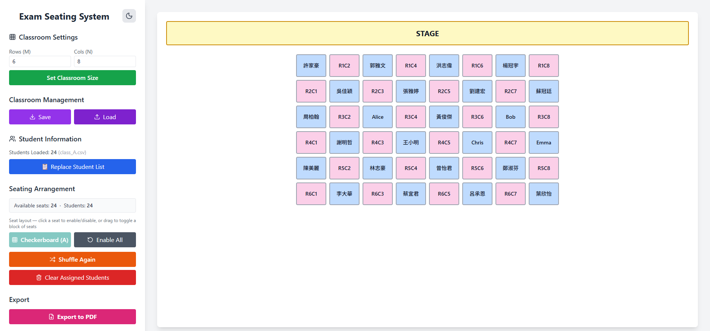

# Exam Seating System - Web Version


A modern, browser-based exam seating arrangement system built with React. Generate randomized seating charts with support for custom classroom layouts, CSV student imports, and PDF exports—all running entirely in your browser with no backend required.

🌐 **[Seating System Web](https://jameslin102.github.io/Seating-System-Web/)**

## ✨ Features

### 🏫 Flexible Classroom Configuration
- Define custom classroom dimensions (M × N grid)
- Visual stage/platform indicator at the front
- Click to enable/disable specific seats to match actual classroom layouts
- Drag with the mouse to toggle a whole block of seats at once
- One-click checkerboard (staggered) layout — click again to switch between the two patterns
- "Enable All" to reset every seat in one click
- Save and load classroom configurations (JSON format)

### 👥 Student Management
- Import student lists from CSV files
- Interactive column selector with a preview of each column (skipped automatically for single-column files)
- Supports UTF-8 and Big5 encoding (CSV files saved from Excel)
- Real-time available seats vs. students count, with a warning when seats are not enough

### 🎲 Smart Seating Arrangement
- One-click random seat assignment
- Visual color-coded seat status:
  - 🟢 **Green**: Available seats
  - 🩷 **Pink**: Disabled seats
  - 🔵 **Blue**: Assigned seats
- Shuffle again or clear assigned students anytime (seat layout is kept)

### 📄 PDF Export
- High-quality PDF generation with full Chinese character support
- Custom title (Chinese or English) entered on export
- Professional seating chart layout
- Landscape A4 format optimized for printing
- Preserves all visual styling and colors

### 🎨 Interface
- Dark mode (follows system preference by default)
- Responsive layout for desktop and mobile
- Non-blocking error notifications — no pop-ups for successful actions

### 💾 Browser Storage
- All processing happens locally in your browser
- No data is sent to any server
- Privacy-focused design

## 📖 User Guide

### Step 1: Configure Classroom
1. Enter the number of rows (M) and columns (N)
2. Click "Set Classroom Size"
3. Click on seats to disable them (to match your classroom layout), or drag to toggle a block of seats
4. (Optional) Click "Checkerboard" for a staggered layout; click again to switch patterns. "Enable All" resets all seats
5. (Optional) Save the configuration for future use

### Step 2: Import Students
1. Click "Load Student List"
2. Select your CSV file
3. Choose the column containing student names

### Step 3: Arrange Seats
1. Click "Random Arrangement" to automatically assign students
2. Review the arrangement on the visual seating chart
3. Click "Shuffle Again" for a new arrangement, or "Clear Assigned Students" to remove students from seats

### Step 4: Export
1. Click "Export to PDF"
2. Enter a title for the chart (default: "Exam Seating Chart") and press Export
3. Save the seating chart for distribution or printing

## 📁 CSV File Format

Your CSV file can have any structure (UTF-8 or Big5). The application will prompt you to select which column contains student names.

**Example CSV:**
```csv
Student ID,Name,Class,Grade
001,Offer Yang,A,10
002,Uploader Li,B,10
003,Director Wang,A,10
004,ComedyGod Lin,A,10
005,FriedFish Chiu,B,10
```

Just select the "Name" column when prompted.

## 🐍 Python Desktop Version

This project also has a Python desktop version with GUI:
- **Repository**: https://github.com/JamesLin102/Seating-System.git
- Features PDF export with Chinese font support
- Ideal for offline use